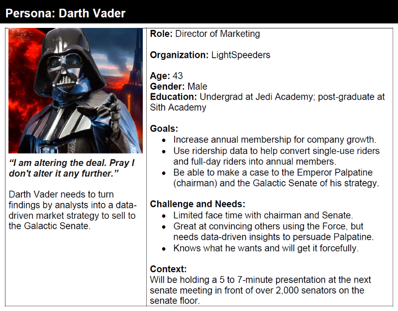
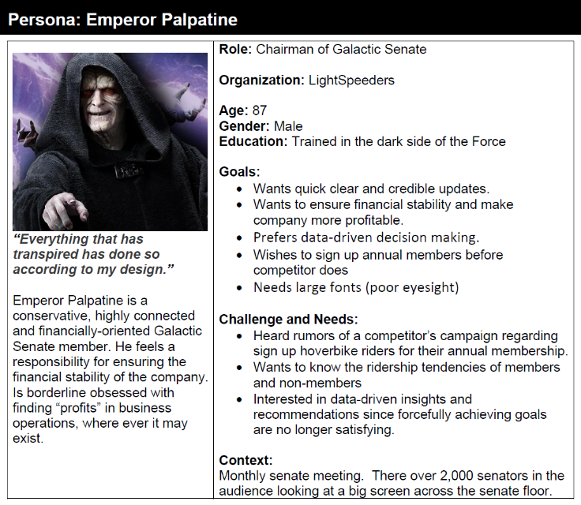

# LightSpeeders

Data Visualization story can be found here:  
https://public.tableau.com/app/profile/kevinvchin/viz/LightSpeeders/LightSpeeders

## EXECUTIVE SUMMARY

The topic will be how we can convert casual hover bike riders (Rebels) to annual membership holders (Imperials) for a hover bike ride-sharing company. I chose this topic because it compliments a project for the [Google Data Analytics Professional Certificate](https://www.coursera.org/professional-certificates/google-data-analytics) course offered by Coursera. I have always wanted to convert the R programming language project to a Tableau story but never had the time, but now is the chance to do so… with a twist!

## WHY
•	**Business Case/Other Goals** - The Director of Marketing at LightSpeeders, Darth Vader, believes the company’s future success depends on maximizing the number of annual memberships. Therefore, the team wants to understand how casual hover bike riders (Rebels) and annual members (Imperials) use LightSpeeders hover bikes differently. From these insights, the team will design a new marketing strategy to convert Rebels into Imperials. But first, LightSpeeders executives must approve the recommendations, so they must be backed up with compelling data insights and professional data visualizations.

•	**Intended Outcome** – LightSpeeders’ finance analysts have concluded that annual members are much more profitable than casual riders, who consist of single-use riders and full-day riders. Darth Vader believes that maximizing the number of Imperials will be key to future growth and he believes there is a very good chance to Rebels into Imperials.

## WHO
•	**Stakeholder** – Persona 1: Darth Vader (Director of Marketing)

•	**Audience** –   
o	**Quantitative Audience**: Galactic Senate senators/members who do not understand the minutiae of the business; prefers top-level facts  
o	**Qualitative Audience**: Persona 2: Emperor Palpatine (chairman)

•	**Subject-Matter Experts** – Business intelligence Analysts and Data Analysts

## WHAT
•	Data Sources – [Trip data](https://divvy-tripdata.s3.amazonaws.com/index.html) stored by LightSpeeders. It is broken up monthly and stored as 12 .zip files:  
o	[202306-divvy-tripdata.zip](https://divvy-tripdata.s3.amazonaws.com/202306-divvy-tripdata.zip)  
o	[202307-divvy-tripdata.zip](https://divvy-tripdata.s3.amazonaws.com/202307-divvy-tripdata.zip)  
o	[202308-divvy-tripdata.zip](https://divvy-tripdata.s3.amazonaws.com/202308-divvy-tripdata.zip)  
o	[202309-divvy-tripdata.zip](https://divvy-tripdata.s3.amazonaws.com/202309-divvy-tripdata.zip)  
o	[202310-divvy-tripdata.zip](https://divvy-tripdata.s3.amazonaws.com/202310-divvy-tripdata.zip)  
o	[202311-divvy-tripdata.zip](https://divvy-tripdata.s3.amazonaws.com/202311-divvy-tripdata.zip)  
o	[202312-divvy-tripdata.zip](https://divvy-tripdata.s3.amazonaws.com/202312-divvy-tripdata.zip)  
o	[202401-divvy-tripdata.zip](https://divvy-tripdata.s3.amazonaws.com/202401-divvy-tripdata.zip)  
o	[202402-divvy-tripdata.zip](https://divvy-tripdata.s3.amazonaws.com/202402-divvy-tripdata.zip)  
o	[202403-divvy-tripdata.zip](https://divvy-tripdata.s3.amazonaws.com/202403-divvy-tripdata.zip)  
o	[202404-divvy-tripdata.zip](https://divvy-tripdata.s3.amazonaws.com/202404-divvy-tripdata.zip)  
o	[202405-divvy-tripdata.zip](https://divvy-tripdata.s3.amazonaws.com/202405-divvy-tripdata.zip)

The data has been made available by Motivate International Inc. under this [license](https://www.divvybikes.com/data-license-agreement).  
The 12 .zip files were downloaded, stored, and extracted into the /LightSpeeders/raw_trip_data/ directory.

•	**Data Quality** – The files will need to be cleaned and combined. The data cleaning process done with Python can be view [here](https://github.com/KevinVChin/Tableau/blob/main/LightSpeeders/data_cleaning.ipynb) or link here:
[https://github.com/KevinVChin/Tableau/blob/main/LightSpeeders/data_cleaning.ipynb](https://github.com/KevinVChin/Tableau/blob/main/LightSpeeders/data_cleaning.ipynb)

•	**Data Timeliness** – The data goes back many years, but we will use data available for the last 12 months (June 2023 to May 2024).

## WHY
•	**Business Case/Other Goals** – The Director of Marketing at LightSpeeders, Darth Vader, believes the company’s future success depends on maximizing the number of Imperials. Therefore, the team wants to understand how Rebels and Imperials use LightSpeeders hover bikes differently. 

•	**Intended Outcome** – To ensure financial stability and make the company more profitable by converting single-use and full-day riders into annual members.
HOW
•	**Format(s)** – multi-frame visualization, narrated dashboard, presentation slides, etc.

•	**Presentation Vehicle** – 5 to 7-minute presentation on the senate floor; font needs to be larger for people with bad eyesight.

Data Visualization story can be found here:  
https://public.tableau.com/app/profile/kevinvchin/viz/LightSpeeders/LightSpeeders
